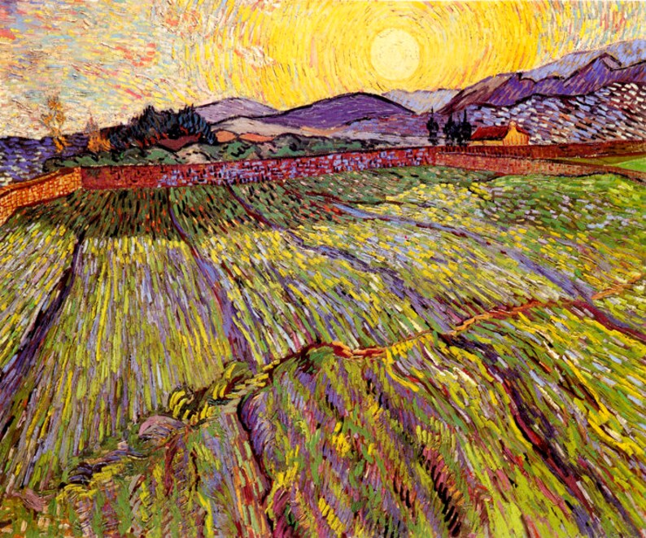

--- 
title: "Incorporating Spatial Analysis into Agricultural Field Experiments."
author:
  - Julia Piaskowski^[University of Idaho, jpiaskowski@uidaho.edu]
  - William Price^[University of Idaho, bprice@uidaho.edu]
date: "`r format(Sys.Date(), '%B %d, %Y')`"
site: bookdown::bookdown_site
documentclass: book
bibliography: [book.bib, packages.bib, extra.bib]
biblio-style: apalike
link-citations: yes
description: "Instructions for identifying spatial autocorrelation in agricultural field trials and incorporating spatial variation into analysis of trial using R and SAS."
github-repo: IdahoAgStats/guide-to-field-trial-spatial-analysis
---

# Preface

```{r, echo=FALSE,out.width="90%",fig.align='center'}
#knitr::include_graphics("img/road-auvers-after-rain-6_2840.jpg")

```
<center>

Vincent Van Gogh

</center>

## Tutorial goal

*To help people conducting planned agricultural field trials understand and incorporate spatial variation routinely into analysis of field trials.*

Current educational resources are focused largely on geospatial applications that typically require a a moderate to deep understanding of  mapping tools and spatial analytic techniques. Furthermore, there is not a comprehensive resources for spatial analytic techniques for field experiments that is also freely available. This tutorial is intended to fill that gap. 

## Prerequisites

In order to run the scripts in this demonstration, you will to download R, available free through the [Comprehensive R Archive Network](https://cran.r-project.org/) (CRAN). While this is sufficient for running R scripts, You may also find it helpful to use RStudio, which provides a nice graphical user interface for R. RStudio can be downloaded [here](https://www.rstudio.com/products/rstudio/download/).

If you already have R installed, please make sure you have version 4.0.0 or newer. 

This demonstration is not intended to provide instructions on general R usage. However, There are numerous web resources for learning the Basics of R. [Software carpentry](https://software-carpentry.org/lessons/) offers several lesson plans covering the foundation of R.  

## R requirements

This tutorial was built using R version 4.1 ("Camp Pontanezen"). R session information is provided in section \@ref(the-end). 

**R Packages used in this tutorial**  

|Package |Usage in This Tutorial |
|------------|---------------|
|dplyr, tidyr, purrr | basic data manipulation | 
|ggplot, desplot | plotting | 
|agridat | contains demonstration data sets |
| sp, sf | standard manipulation of spatial objects | 
|spdep | spatial dependence functions | 
|gstat | empirical variogram estimation | 
|nlme, lme4 | mixed model analysis | 
|emmeans| extract treatments means |
| spaMM | Matérn covariance structure |
|SpATS | spatial splines for field trials |
|breedR | mixed modelling with AR1xAR1 estimation |

All packages aside from **breedR** are available on CRAN. The package **breedR**, is available on GitHub can be installed within R with the following code:

```
remotes::install_github("famuvie/breedR")
```

## SAS requirements

In order to run the SAS portion of this tutorial, a valid copy of SAS Base and Stat products and a current SAS license are required. This tutorial was built using SAS 9.4 (TS1M5). Although older versions of SAS may also work, we have not evaluated this. Users can also consider downloading and using a free version of [SAS® On Demand for Academics: Studio](https://www.sas.com/en_us/software/on-demand-for-academics/references/getting-started-with-sas-ondemand-for-academics-studio.html). 

**SAS procedures used in this tutorial**  

|Procedure |Usage in This Tutorial |
|------------|---------------|
|FORMAT, DATA, PRINT | basic data input, manipulation, and display | 
|SORT, RANK| sort and rank estimated means | 
|SGPLOT| plotting | 
|MIXED, GLIMMIX| mixed model analysis | 
|VARIOGRAM| empirical variogram estimation | 


## Contributors

[Julia Piaskowski](mailto:jpiaskowski@uidaho.edu) wrote the R sections and William Price wrote the SAS portions of this tutorial.

This book was written in [bookdown](https://bookdown.org/yihui/bookdown). 

## License

Incorporating Spatial Analysis into Agricultural Field Experiments by Julia Piaskowski and William Price is licensed under a [Creative Commons Attribution-NonCommercial 4.0 International License](https://creativecommons.org/licenses/by-nc/4.0/)

```{r, echo=FALSE,out.width="20%",fig.align='center'}
knitr::include_graphics(c("img/CC-by-nc.png"))
```


```{r include=FALSE}
# automatically create a bib database for R packages
knitr::write_bib(c(
  .packages(), 'bookdown', 'knitr', 'tidyr', 'rmarkdown', 'gstat', 'sf',
  'dplyr','ggplot2', 'purrr', 'nlme', 'lme4', 'emmeans','spaMM', 'sp', 'spdep', 'spreg',
  'INLA', 'breedR', 'agridat', 'desplot', 'SpATS', 'psych'), 'packages.bib')
```
